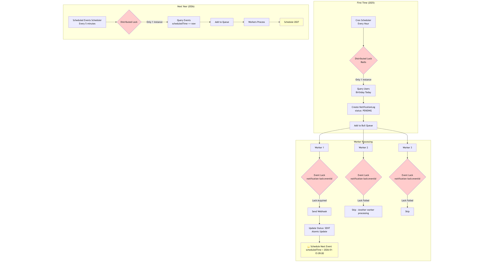

# Birthday Notification System

A robust, scalable Node.js application designed to send birthday notifications to users at exactly 9 AM in their local timezone. Built with **NestJS**, **MongoDB**, **Redis**, and **Bull**.

## 🚀 Key Features

### 1. Timezone Aware
- Sends notifications based on each user’s local time.

### 2. High Performance & Scalable
- **Day-Based Generator**  
  Checks days in parallel chunk (10-day groups)
- **Parallel Processing**  
  Uses Bull Queue with multiple workers (e.g., 10 workers) to process many jobs at the same time.
- **Distributed Locking**  
  Uses Redis locks to make sure only one worker processes an event to avoid duplicates.

### 3. Reliability
- **No Duplicate Jobs**  
  Uses a fixed `jobId` (Event Log ID) to prevent duplicate queue jobs.
- **Auto Recovery**  
  Pre-calculated events allow easy recovery after downtime.  
  Failed jobs are removed from Redis so they can retry cleanly.
- **User Update Sync**  
  When a user changes timezone or birthday, future events are recalculated automatically.

## 🛠 Tech Stack

*   **Framework**: [NestJS](https://nestjs.com/) (TypeScript)
*   **Database**: [MongoDB](https://www.mongodb.com/) (Data storage)
*   **Queue**: [Bull](https://github.com/OptimalBits/bull) (Job processing)
*   **Cache**: [Redis](https://redis.io/) (Distributed locks)
*   **Testing**: [Jest](https://jestjs.io/) (Unit tests)

## 🔄 System Flow (Pre-Calculation Model)

### Flow Diagram



1.  **User Management**:
    *   Users are created via API.
    *   **User updates** (timezone/birthday changes) trigger automatic recalculation of ALL future pending events.

2.  **Event Generator (Hourly)**:
    *   **Strategy**: Date-Centric Parallel Scan.
    *   For each day, finds users matching `month` and `day`.
    *   Creates `NotificationLog` records using `bulkWrite` with `upsert` (prevents duplicates).

3.  **Event Dispatcher (Every 5 Minutes)**:
    *   Queries `NotificationLog` for events with `status: PENDING` and `scheduledAt <= now`.
    *   Pushes matching events to the `notification` Bull Queue with **Fixed JobID** (`eventLogId`).

4.  **Notification Worker**:
    *   `NotificationProcessor` picks up jobs (Concurrency: 10).
    *   Acquires a **Redis Lock** for the specific event.
    *   Checks status (skip if already `SENT`).
    *   Sends webhook request.
    *   Updates status to `SENT` or `FAILED`.

5.  **Recovery (Every 30 Minutes)**:
    *   Retries `FAILED` events (up to max retry attempts).
    *   Detects `PENDING` events stuck > 1 hour and re-queues them.

## 🏁 Getting Started

### Prerequisites

*   Docker & Docker Compose
*   Node.js (v18+) & NPM (for local testing)

### Installation

1.  Clone the repository:
    ```bash
    git clone <repository-url>
    cd birthday-notification
    ```

2.  Install dependencies:
    ```bash
    npm install
    ```

3.  Setup Environment Variables:
    ```bash
    cp .env.example .env
    ```

### Running the Application

Start the entire stack (App + MongoDB + Redis) using Docker:

```bash
docker-compose up -d
```

*   **API**: `http://localhost:3000`
*   **Test Webhook**: `http://localhost:3000/test-webhook`

### Seeding Data

**1. User Seeding (1 Million Users)**
Populates the database with fake users.
```bash
# Ensure MongoDB is running on localhost:27018 (exposed by Docker)
npx ts-node src/database/seeders/seed-user.ts
```


## 🧪 Testing

```bash
# Run Unit Tests
npm test (or make test)

```

## 🔌 API Reference

### User Management
*   `POST /user`: Create a user.
*   `DELETE /user/:id`: Delete a user.
*   `PUT /user/:id`: Update user details.

### Scheduler Triggers (Manual)
*   `POST /scheduler/trigger-generation`: Trigger Generator manually.
*   `POST /scheduler/trigger-dispatch`: Trigger Dispatcher manually.

### Test Webhook
*   `POST /test-webhook`: Simulates a webhook receiver.

---
Author: Bryan